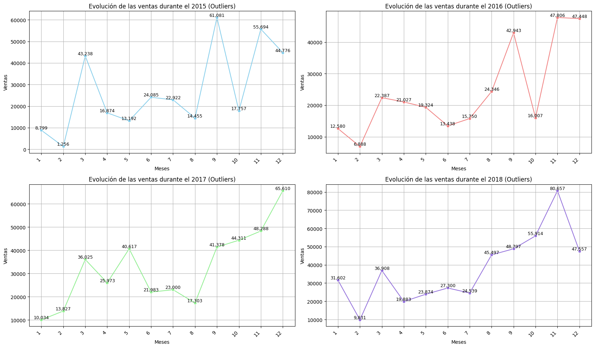
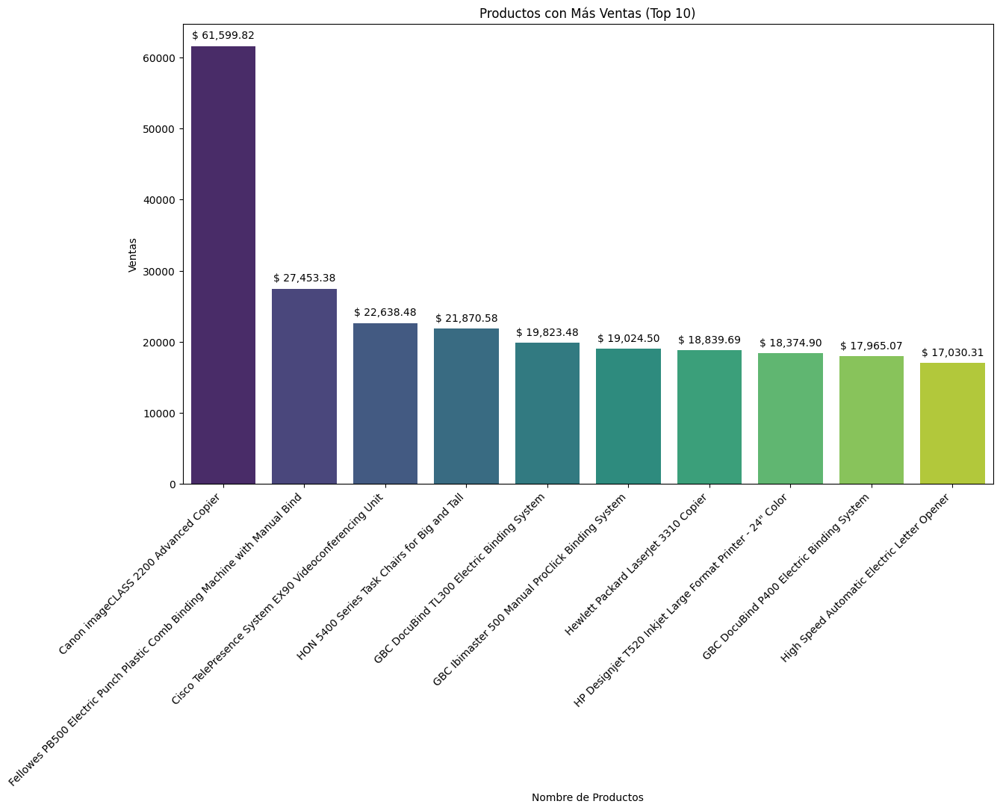
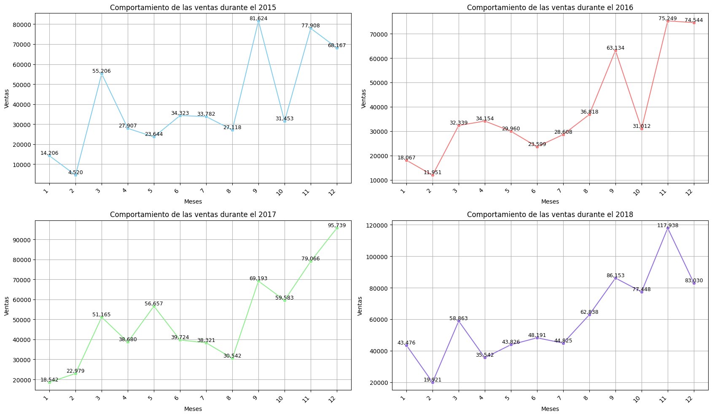

# 📊 SuperStore Sales
# SuperStore Sales Analysis

Este proyecto consiste en un dashboard interactivo y la generación de reportes ejecutivos. Ambas herramientas están diseñadas para analizar el rendimiento de la entrega de pedidos. Los datos utilizados provienen de un conjunto de datos real de entregas recopilado por [Rohit Sahoo](https://www.kaggle.com/rohitsahoo).

---

## 📚 Tabla de Contenidos

- [🎯 Propósito](#-propósito)
- [📦 Conjunto de Datos](#-conjunto-de-datos)
- [🧪 Desarrollo del Proyecto](#-desarrollo-del-proyecto)
- [📌 Vista previa del Dashboard](#-vista-previa-del-dashboard)
- [💡 Insight clave](#-insight-clave)
- [📈 Recomendaciones](#-recomendaciones)
- [🛠️ Tecnologías](#️-tecnologías)
- [⚙️ Instalación](#️-instalación)
- [📂 Archivos](#-archivos)
- [👤 Autor](#-autor)
- [📝 Licencia](#-licencia)

---

## 🎯 Propósito

El proyecto busca evaluar el comportamiento de las ventas de una tienda minorista a partir de datos históricos, considerando diferentes dimensiones clave como producto, cliente, categoría y región. El objetivo es descubrir patrones relevantes, identificar áreas de oportunidad, anticipar riesgos potenciales y establecer estrategias basadas en datos que impulsen decisiones comerciales informadas.

- Obtener KPI's:
   - KPI's de Ventas y Rendimiento Financiero
   - KPI's de Eficiencia Operativa
   - KPI's de Clientes y Mercado

- Analizar el rendimiento de ventas
   - Analizar los ingresos por productos vendidos
   - Analizar su comportamiento en distintos contextos

- Análisis de múltiples dimensiones (Productos, clientes, categorías y región)

- Detectar oportunidades de mejora
   - ¿Dónde se puede aumentar ventas, eficiencia o márgenes?

- Identificar riesgos
   - ¿Qué productos, categorías, clientes o región tiene bajas las ventas y representas un riesgo?

- Encontrar palancas estratégicas
   - ¿Qué están funcionando bien y si se puede escalar?

---

## 📦 Conjunto de Datos

El conjunto de datos utilizado contiene las siguientes columnas:

- `Row ID`: Id de la fila
- `Order ID`: Id del pedido
- `Order Date`: Fecha del pedido
- `Ship Date`: Fecha de envio
- `Ship Mode`: Modo barco
- `Customer ID`: Id del cliente
- `Customer Name`: Nombre del cliente
- `Segment`: Segmento
- `Country`: País
- `City`: Ciudad
- `State`: Estado
- `Postal Code`: Código postal
- `Region`: Región
- `Product ID`: Identificación del producto
- `Category`: Categoría
- `Sub-Category`: SubCategoría
- `Product Name`: Nombre del producto
- `Sales`: Ventas

Fuente: [Superstore Sales Dataset](https://www.kaggle.com/datasets/rohitsahoo/sales-forecasting).

---

## 🧪 Desarrollo del Proyecto

### 1. **Carga y exploración inicial de los datos**
La primera fase de nuestro proyecto fue una exploración exhaustiva del conjunto de datos Superstore Sales. Esta etapa nos permitió obtener una visión general de su composición, confirmando que contiene 9800 registros y 18 columnas.

Esta exploración inicial es crucial para identificar posibles problemas que podrían afectar el análisis, como:
•	Valores duplicados.
•	Valores nulos.
•	Errores de registro (por ejemplo, errores tipográficos).
•	Valores atípicos (valores que se desvían significativamente de la mayoría de los datos).
•	Distribución de datos.

Durante este proceso, se identificaron dos problemas principales:
1.	Se encontraron 11 registros con valores nulos en la columna Postal Code. Afortunadamente, este problema no representa un gran obstáculo, ya que contamos con información complementaria en otras columnas que nos permitirá rellenar los datos faltantes de manera precisa.

2.	Se detectaron valores atípicos en el conjunto de datos. Para abordar este hallazgo, se llevará a cabo un análisis más profundo para comprender la naturaleza de estos registros. Esto nos ayudará a determinar si son datos erróneos que deben ser eliminados, o si representan eventos reales (como ventas excepcionalmente altas) que necesitan ser considerados en el análisis.

Este primer paso nos ha dado una base sólida para comenzar el proceso de limpieza y preparación de datos, asegurando que nuestro análisis posterior sea lo más preciso y fiable posible.

***Archivo:*** [exploracion_inicial.ipynb](notebooks/exploracion_inicial.ipynb)

### 2. **Análisis Valores Atípicos**

El análisis de los registros con valores atípicos en el conjunto de datos de Superstore Sales, respaldado por el script de Python y la visualización adjunta, ha demostrado que estas fluctuaciones en las ventas no son errores de datos. Por el contrario, representan escenarios de precios volátiles y estratégicos, algo común en mercados dinámicos.


Como se puede observar en el gráfico, los precios fluctúan ampliamente a lo largo de los años 2015 a 2018. Esto sugiere que las variaciones son parte del comportamiento natural del mercado, posiblemente debido a promociones, cambios estacionales o estrategias de la empresa.

El script de Python, que utiliza la biblioteca fuzzywuzzy para comparar nombres de productos y un análisis de la evolución del precio por mes, permitió confirmar que estas fluctuaciones son consistentes con la dinámica de precios del mercado, en lugar de ser errores de registro. Este hallazgo es crucial para el proyecto, ya que nos permite mantener estos datos en el conjunto para un análisis más completo y realista.

***Archivos:*** 
* [eda_outliers.ipynb](notebooks/eda_outliers.ipynb)
* [evolucion_precios_productos.py](scripts/evolucion_precios_productos.py)


### 3. **Limpieza y preprocesamiento**
A partir del análisis exploratorio y del manejo de valores atípicos, se procede a la fase de limpieza de datos. El único problema identificado fue la presencia de 11 valores nulos en la columna Postal Code, lo cual se resolverá mediante una imputación.

Se imputaron los valores faltantes en la columna Postal Code con el código 05403. Esta decisión se tomó al verificar que el código postal de la ciudad de Burlington en Vermont (único registro sin Postal Code pero con todos los demás datos geográficos completos) es 05403.

Adicionalmente, se realizó una transformación del tipo de dato de la columna Postal Code, convirtiéndola de float a un formato de texto (string) y eliminando el .0 de los valores existentes para estandarizar el formato.

El script de Python utilizado para esta tarea es el siguiente:
```Python
# Rellenar los valores nulos en la columna Postal Code
df_store_sales['Postal Code'] = df_store_sales['Postal Code'].fillna('05403')

# Transformación de columna Postal Code
df_store_sales['Postal Code'] = df_store_sales['Postal Code'].astype(str)

# Eliminar .0 de los demás datos
df_store_sales['Postal Code'] = df_store_sales['Postal Code'].str.replace('.0', '', regex=False)

# Verificación de la cantidad de valores nulos
valores_nulos = df_store_sales['Postal Code'].isnull().sum()
print(f'Cantidad de valores nulos: {valores_nulos}')
# Salida: Cantidad de valores nulos: 0

# Filas donde se imputaron los valores nulos
filas_05403 = df_store_sales[df_store_sales['Postal Code'] == '05403']
print(filas_05403)
```

Nota: Las columnas de fecha (Order Date y Ship Date) se mantendrán en su formato actual y se convertirán a un tipo de dato de fecha (datetime) solo cuando sea necesario para un análisis específico, a fin de optimizar el rendimiento y la memoria.

Finalmente, el conjunto de datos, ahora limpio y preparado, se ha guardado en un nuevo archivo CSV llamado store_sales_limpio.csv para su uso en futuras etapas del análisis.

***Archivo:*** [limpieza.ipynb](notebooks/limpieza.ipynb)

### 4. **Análisis exploratorio de datos (EDA)**
Ahora que el conjunto de datos está limpio, es posible proceder al análisis de los principales indicadores de rendimiento (KPIs) para obtener información valiosa sobre el negocio.

**KPI's de Ventas y Rendimiento Financiero**
* Los ingresos totales acumulados a lo largo del periodo analizado, que reflejan el rendimiento global del negocio.
* El valor promedio de cada transacción, un indicador clave para entender el tamaño de las compras de los clientes.
* El análisis de ventas por categoría y subcategoría proporciona una visión detallada de los productos que más contribuyen a los ingresos. La categoría de Tecnología es la más rentable, seguida de Mobiliario y Material de Oficina.
* La distribución geográfica de las ventas revela cuáles son las regiones más importantes para el negocio.

```Bash
   KPIs de Ventas y Rendimiento Financiero

Ventas Totales: $2261536.78
Ventas Promedio por Pedido: $230.77

Ventas pro Categoria
Category
Furniture          728658.5757
Office Supplies    705422.3340
Technology         827455.8730
Name: Sales, dtype: float64

Ventas por Categoria y Sub-Categoria
Category         Sub-Category
Furniture        Bookcases       113813.1987
                 Chairs          322822.7310
                 Furnishings      89212.0180
                 Tables          202810.6280
Office Supplies  Appliances      104618.4030
                 Art              26705.4100
                 Binders         200028.7850
                 Envelopes        16128.0460
                 Fasteners         3001.9600
                 Labels           12347.7260
                 Paper            76828.3040
                 Storage         219343.3920
                 Supplies         46420.3080
Technology       Accessories     164186.7000
                 Copiers         146248.0940
                 Machines        189238.6310
                 Phones          327782.4480
Name: Sales, dtype: float64

Ventas por Región
Region
Central    492646.9132
East       669518.7260
South      389151.4590
West       710219.6845
Name: Sales, dtype: float64
```

**KPI's de la Eficiencia Operativa**
* Este KPI es fundamental para evaluar la agilidad de la cadena de suministro y la satisfacción del cliente. Un tiempo de preparación corto y consistente indica un proceso logístico eficiente y una capacidad sólida para cumplir con los pedidos de manera oportuna.

```Bash
    KPIs de la Eficiencia Operativa    

Tiempo Promedio de Preparación(Días): 4 días

```

El análisis de los ingresos totales por producto ha permitido identificar a los 10 productos más vendidos en términos de ingresos acumulados a lo largo de los cuatro años. 

El producto con el ingreso más alto es la Canon imageCLASS 2200 Advanced Copier, que generó $61,599.82 USD.


El comportamiento de las ventas a lo largo de los años 2015 a 2018 muestra un claro patrón estacional. Como se puede ver en los gráficos, los meses de septiembre, noviembre y diciembre son consistentemente los de mayores ventas, lo que probablemente se deba a la temporada de festividades. Por el contrario, los meses de febrero y agosto registran las ventas más bajas.

Se ha obtenido un desglose de los ingresos generados por los clientes, destacando a aquellos que han aportado mayores ventas. Sean Miller es el cliente con el mayor ingreso registrado, con $25,043.05 USD. Se identificó que los clientes más rentables pertenecen principalmente a los segmentos de Home Office y Corporate.
<div>
<table border="1" class="dataframe">
  <thead>
    <tr style="text-align: right;">
      <th></th>
      <th></th>
      <th></th>
      <th>Sales</th>
    </tr>
    <tr>
      <th>Customer ID</th>
      <th>Customer Name</th>
      <th>Segment</th>
      <th></th>
    </tr>
  </thead>
  <tbody>
    <tr>
      <th>SM-20320</th>
      <th>Sean Miller</th>
      <th>Home Office</th>
      <td>25043.050</td>
    </tr>
    <tr>
      <th>TC-20980</th>
      <th>Tamara Chand</th>
      <th>Corporate</th>
      <td>19052.218</td>
    </tr>
    <tr>
      <th>RB-19360</th>
      <th>Raymond Buch</th>
      <th>Consumer</th>
      <td>15117.339</td>
    </tr>
    <tr>
      <th>TA-21385</th>
      <th>Tom Ashbrook</th>
      <th>Home Office</th>
      <td>14595.620</td>
    </tr>
    <tr>
      <th>AB-10105</th>
      <th>Adrian Barton</th>
      <th>Consumer</th>
      <td>14473.571</td>
    </tr>
    <tr>
      <th>KL-16645</th>
      <th>Ken Lonsdale</th>
      <th>Consumer</th>
      <td>14175.229</td>
    </tr>
    <tr>
      <th>SC-20095</th>
      <th>Sanjit Chand</th>
      <th>Consumer</th>
      <td>14142.334</td>
    </tr>
    <tr>
      <th>HL-15040</th>
      <th>Hunter Lopez</th>
      <th>Consumer</th>
      <td>12873.298</td>
    </tr>
    <tr>
      <th>SE-20110</th>
      <th>Sanjit Engle</th>
      <th>Consumer</th>
      <td>12209.438</td>
    </tr>
    <tr>
      <th>CC-12370</th>
      <th>Christopher Conant</th>
      <th>Consumer</th>
      <td>12129.072</td>
    </tr>
  </tbody>
</table>
</div>

El análisis de ingresos por categorías y subcategorías revela cuáles son las áreas de negocio más rentables. Las subcategorías de Phones, Chairs y Storage son las que más ingresos generan, dominando los sectores de Tecnología, Mobiliario y Material de Oficina.
<div>
<table border="1" class="dataframe">
  <thead>
    <tr style="text-align: right;">
      <th></th>
      <th></th>
      <th>Sales</th>
    </tr>
    <tr>
      <th>Category</th>
      <th>Sub-Category</th>
      <th></th>
    </tr>
  </thead>
  <tbody>
    <tr>
      <th>Technology</th>
      <th>Phones</th>
      <td>327782.4480</td>
    </tr>
    <tr>
      <th>Furniture</th>
      <th>Chairs</th>
      <td>322822.7310</td>
    </tr>
    <tr>
      <th>Office Supplies</th>
      <th>Storage</th>
      <td>219343.3920</td>
    </tr>
    <tr>
      <th>Furniture</th>
      <th>Tables</th>
      <td>202810.6280</td>
    </tr>
    <tr>
      <th>Office Supplies</th>
      <th>Binders</th>
      <td>200028.7850</td>
    </tr>
    <tr>
      <th rowspan="3" valign="top">Technology</th>
      <th>Machines</th>
      <td>189238.6310</td>
    </tr>
    <tr>
      <th>Accessories</th>
      <td>164186.7000</td>
    </tr>
    <tr>
      <th>Copiers</th>
      <td>146248.0940</td>
    </tr>
    <tr>
      <th>Furniture</th>
      <th>Bookcases</th>
      <td>113813.1987</td>
    </tr>
    <tr>
      <th>Office Supplies</th>
      <th>Appliances</th>
      <td>104618.4030</td>
    </tr>
  </tbody>
</table>
</div>

Finalmente, se ha obtenido información sobre los ingresos por ubicación geográfica, desglosando los datos por país, región, estado y ciudad. Las ciudades de Jamestown (NY) y Lafayette (IN) son las que reportan mayores ingresos, con ventas que superan los $2,354 USD y $1,784 USD respectivamente.
<div>
<table border="1" class="dataframe">
  <thead>
    <tr style="text-align: right;">
      <th></th>
      <th></th>
      <th></th>
      <th></th>
      <th></th>
      <th>Sales</th>
    </tr>
    <tr>
      <th>Country</th>
      <th>Region</th>
      <th>State</th>
      <th>City</th>
      <th>Postal Code</th>
      <th></th>
    </tr>
  </thead>
  <tbody>
    <tr>
      <th rowspan="10" valign="top">United States</th>
      <th>East</th>
      <th>New York</th>
      <th>Jamestown</th>
      <th>14701</th>
      <td>2354.395000</td>
    </tr>
    <tr>
      <th>Central</th>
      <th>Indiana</th>
      <th>Lafayette</th>
      <th>47905</th>
      <td>1784.046364</td>
    </tr>
    <tr>
      <th rowspan="2" valign="top">West</th>
      <th>Wyoming</th>
      <th>Cheyenne</th>
      <th>82001</th>
      <td>1603.136000</td>
    </tr>
    <tr>
      <th>Washington</th>
      <th>Bellingham</th>
      <th>98226</th>
      <td>1263.413333</td>
    </tr>
    <tr>
      <th>Central</th>
      <th>Missouri</th>
      <th>Independence</th>
      <th>64055</th>
      <td>1208.685000</td>
    </tr>
    <tr>
      <th>South</th>
      <th>North Carolina</th>
      <th>Burlington</th>
      <th>27217</th>
      <td>1152.843818</td>
    </tr>
    <tr>
      <th>West</th>
      <th>California</th>
      <th>Burbank</th>
      <th>91505</th>
      <td>1082.386000</td>
    </tr>
    <tr>
      <th rowspan="2" valign="top">East</th>
      <th>New York</th>
      <th>Buffalo</th>
      <th>14215</th>
      <td>906.349600</td>
    </tr>
    <tr>
      <th>Massachusetts</th>
      <th>Beverly</th>
      <th>1915</th>
      <td>861.063333</td>
    </tr>
    <tr>
      <th>West</th>
      <th>Nevada</th>
      <th>Sparks</th>
      <th>89431</th>
      <td>853.986667</td>
    </tr>
  </tbody>
</table>
</div>

4. **Visualización de datos**:
   - Uso de gráficos de barras, líneas, cajas, dispersión y mapas de calor.

5. **Modelado o reportes (opcional)**:
   - [Si aplica: modelos de ML, clustering, predicciones, etc.]

---

## 📌 Vista previa del Dashboard

---

## 💡 Insight clave

---

## 📈 Recomendaciones

- [Insight 1]
- [Insight 2]
- [Recomendación práctica o estratégica basada en los datos]

---

## 🛠️ Tecnologías

- Python
- Pandas
- Matplotlib
- Seaborn
- Jupyter Notebook / Google Colab
- [Otras herramientas que uses, como Scikit-learn, Plotly, etc.]

---

## ⚙️ Instalación

### 1. Clonar este repositorio:
```bash
git clone https://github.com/tu_usuario/nombre_del_proyecto.git
```
### 2. Uso de un Entorno Virtual para Aislar Dependencias

Para evitar conflictos con versiones de librerías, se recomienda usar entornos virtuales.

####  Crear y Activar un Entorno Virtual

##### Crear el entorno virtual:
```
python -m venv venv
```
##### Activar el entorno:
* #### En Windows:

    ```
    venv\Scripts\activate
    ```

* #### En Mac/Linux::

    ```
    source venv/bin/activate
    ```
#### 3. Instalar dependencias dentro del entorno:
* #### Opición 1:
    ```
    pip install -r requirements.txt
    ```

* #### Opción 2 (De forma manual):
    ```
    pip install numpy pandas matplotlib seaborn scikit-learn
    ```

---

## 📂 Archivos

---

## 👤 Autor

**Said Mariano Sánchez** –  📧 *smariano170@gmail.com*  
*Analista de Datos Jr. | Visualización | Power BI | Python | SQL*  
🌎 México  
Este proyecto forma parte de mi portafolio como analista de datos Jr.

---

## 📝 Licencia

Este proyecto está licenciado bajo la **Licencia MIT**. Puedes usarlo, modificarlo y distribuirlo libremente, siempre que menciones al autor original.

---